# TimeWise CRM - Role Workflows

---

## 📊 Complete System Workflow

```mermaid
flowchart TB
    Start([🔐 Login])
    Start --> Role{Select Role}

    %% ============ USER WORKFLOW ============
    Role -->|User| UserDash[👤 USER DASHBOARD]

    UserDash --> U1[Create Time Entry]
    UserDash --> U2[View My Timesheets]
    UserDash --> U3[View My Reports]

    U1 --> U1A[Select: Date, Project, Country, Task, Hours]
    U1A --> U1B[✅ Submit]
    U1B --> UserDash

    U2 --> U2A{Entry Age?}
    U2A -->|≤ 7 days| U2B[✏️ Can Edit/Delete]
    U2A -->|> 7 days| U2C[🔒 View Only - Locked]
    U2B --> UserDash
    U2C --> UserDash

    U3 --> U3A[Monthly Hours, Tasks, Charts]
    U3A --> UserDash

    %% ============ ADMIN WORKFLOW ============
    Role -->|Admin| AdminDash[👑 ADMIN DASHBOARD]

    AdminDash --> A1[👥 Manage Users]
    AdminDash --> A2[📊 Team Timesheets]
    AdminDash --> A3[📈 Reports]
    AdminDash --> A4[🏖️ Leaves]
    AdminDash --> A5[🔔 Notifications]

    A1 --> A1A[Create User]
    A1 --> A1B[Edit User]
    A1 --> A1C[Deactivate User]
    A1A --> A1A1[Set Role: Admin/User/Inspection]
    A1A1 --> A1A2[Set Email & Password]
    A1A2 --> AdminDash
    A1B --> AdminDash
    A1C --> AdminDash

    A2 --> A2A[Search User by Name/Email/Role]
    A2A --> A2B[Filter by Month]
    A2B --> A2C[View All Entries]
    A2C --> A2D[✏️ Edit ANY Entry - No Lock]
    A2C --> A2E[📥 Export to Excel]
    A2D --> AdminDash
    A2E --> AdminDash

    A3 --> A3A[Team Summary]
    A3A --> A3B[Individual Stats]
    A3B --> A3C[Extra Time Report]
    A3C --> AdminDash

    A4 --> A4A[Add Company Holiday]
    A4A --> AdminDash

    A5 --> A5A[Send Email/In-App Alert]
    A5A --> AdminDash

    %% ============ INSPECTION WORKFLOW ============
    Role -->|Inspection| InsDash[🔍 INSPECTION DASHBOARD]

    InsDash --> I1[📊 Compliance Monitor]
    InsDash --> I2[👤 User Calendar]
    InsDash --> I3[❌ Missing Entries]

    I1 --> I1A[Select: 7d/14d/1m/2m/3m]
    I1A --> I1B[View Compliance Stats]
    I1B --> I1C{Filter Level}
    I1C -->|High| I1D[🟢 ≥90%]
    I1C -->|Medium| I1E[🟡 70-89%]
    I1C -->|Low| I1F[🔴 <70%]
    I1D --> I1G[User List]
    I1E --> I1G
    I1F --> I1G
    I1G --> InsDash

    I2 --> I2A[Search User]
    I2A --> I2B[View Calendar]
    I2B --> I2C[📖 View Entries - Read Only]
    I2C --> InsDash

    I3 --> I3A[Calculate Missing Days]
    I3A --> I3B[Exclude: Sundays, 2nd Sat, Holidays]
    I3B --> I3C[Show Missing List]
    I3C --> InsDash

    InsDash --> I4[🔄 Auto-Refresh 60s]
    I4 --> InsDash

    %% ============ STYLING ============
    style Start fill:#2C3E50,color:#fff,stroke:#000,stroke-width:4px
    style Role fill:#34495E,color:#fff,stroke:#000,stroke-width:3px

    style UserDash fill:#3498DB,color:#fff,stroke:#2874A6,stroke-width:4px
    style U1 fill:#5DADE2,color:#fff
    style U2 fill:#5DADE2,color:#fff
    style U3 fill:#5DADE2,color:#fff
    style U1B fill:#27AE60,color:#fff,stroke:#229954,stroke-width:2px
    style U2C fill:#E74C3C,color:#fff,stroke:#C0392B,stroke-width:2px

    style AdminDash fill:#E74C3C,color:#fff,stroke:#A93226,stroke-width:4px
    style A1 fill:#EC7063,color:#fff
    style A2 fill:#EC7063,color:#fff
    style A3 fill:#EC7063,color:#fff
    style A4 fill:#EC7063,color:#fff
    style A5 fill:#EC7063,color:#fff
    style A2D fill:#F39C12,color:#fff,stroke:#D68910,stroke-width:2px
    style A2E fill:#3498DB,color:#fff,stroke:#2874A6,stroke-width:2px

    style InsDash fill:#27AE60,color:#fff,stroke:#1E8449,stroke-width:4px
    style I1 fill:#58D68D,color:#fff
    style I2 fill:#58D68D,color:#fff
    style I3 fill:#58D68D,color:#fff
    style I1D fill:#27AE60,color:#fff,stroke:#229954,stroke-width:2px
    style I1E fill:#F39C12,color:#fff,stroke:#D68910,stroke-width:2px
    style I1F fill:#E74C3C,color:#fff,stroke:#C0392B,stroke-width:2px
```



---

## 👤 USER - How It Works

```
LOGIN
  ↓
USER DASHBOARD
  ↓
  ├─→ CREATE TIME ENTRY
  │     • Select date
  │     • Select project/country
  │     • Enter task & hours
  │     • Submit
  │     ✅ DONE
  │
  ├─→ VIEW MY TIMESHEETS
  │     • Filter by month/date
  │     • View list or calendar
  │     • If ≤7 days: Can edit/delete
  │     • If >7 days: Locked, view only
  │
  └─→ VIEW MY REPORTS
        • Monthly hours
        • Task breakdown
        • Charts
```

**Key Points:**
- ✅ Can create, edit, delete OWN entries
- 🔒 Edit window: 7 days only
- 👁️ Visibility: Own data only

---

## 👑 ADMIN - How It Works

```
LOGIN
  ↓
ADMIN DASHBOARD
  ↓
  ├─→ MANAGE USERS
  │     • Create new user → Set role (Admin/User/Inspection) → Save
  │     • Edit user details
  │     • Activate/Deactivate user
  │
  ├─→ VIEW TEAM TIMESHEETS
  │     • Search by name/email/role
  │     • Filter by user/month
  │     • View ALL team entries
  │     • Edit ANY entry (no 7-day lock)
  │     • Export to Excel
  │
  ├─→ TEAM REPORTS
  │     • Team summary statistics
  │     • Individual user stats
  │     • Extra time tracking
  │
  ├─→ MANAGE LEAVES
  │     • Add company holiday dates
  │     • View leave calendar
  │
  └─→ NOTIFICATIONS
        • Send email alerts
        • Send in-app notifications
```

**Key Points:**
- ✅ Everything User can do
- ✅ Create/manage ALL users
- ✅ View/edit ALL entries (no lock)
- ✅ Export data to Excel
- ✅ Manage holidays & notifications

---

## 🔍 INSPECTION - How It Works

```
LOGIN
  ↓
INSPECTION DASHBOARD (Auto-refresh every 60s)
  ↓
  ├─→ MONITOR COMPLIANCE
  │     • Select time range: 7 days / 14 days / 1 month / 2 months / 3 months
  │     • View compliance stats
  │     • Filter by level:
  │       - 🟢 High (≥90%)
  │       - 🟡 Medium (70-89%)
  │       - 🔴 Low (<70%)
  │     • Click user to view details
  │
  ├─→ VIEW USER CALENDAR
  │     • Search/select any user
  │     • View user's calendar
  │     • View all time entries
  │     • 📖 READ-ONLY (cannot edit)
  │
  └─→ CHECK MISSING ENTRIES
        • Calculate expected work days
        • Exclude: Sundays, 2nd Saturday, Company holidays
        • Show missing days list
        • Generate compliance report
```

**Key Points:**
- 👁️ View ALL users' data
- 📊 Monitor compliance rates
- ❌ Check missing entries
- 🔄 Auto-refresh every 60 seconds
- 🚫 READ-ONLY: Cannot edit/delete anything

---

## 📊 Role Comparison

| Action | User | Admin | Inspection |
|--------|------|-------|------------|
| Create own entries | ✅ | ✅ | ❌ |
| View own data | ✅ | ✅ | ❌ |
| Edit own (≤7 days) | ✅ | ✅ | ❌ |
| View ALL users | ❌ | ✅ | ✅ |
| Edit ANY entry | ❌ | ✅ | ❌ |
| Create users | ❌ | ✅ | ❌ |
| Export Excel | ❌ | ✅ | ❌ |
| Check compliance | ❌ | ✅ | ✅ |
| Manage holidays | ❌ | ✅ | ❌ |

---

## 🎯 Key Rules

| Rule | Details |
|------|---------|
| **7-Day Lock** | Users can edit for 7 days. Admin bypasses this. |
| **Work Days** | Mon-Sat (exclude Sundays & 2nd Saturday) |
| **Compliance** | (Completed Days ÷ Expected Days) × 100 |
| **Auto-Refresh** | Inspection dashboard refreshes every 60s |

---

**Simple, precise, and clear workflows for all three roles.**
